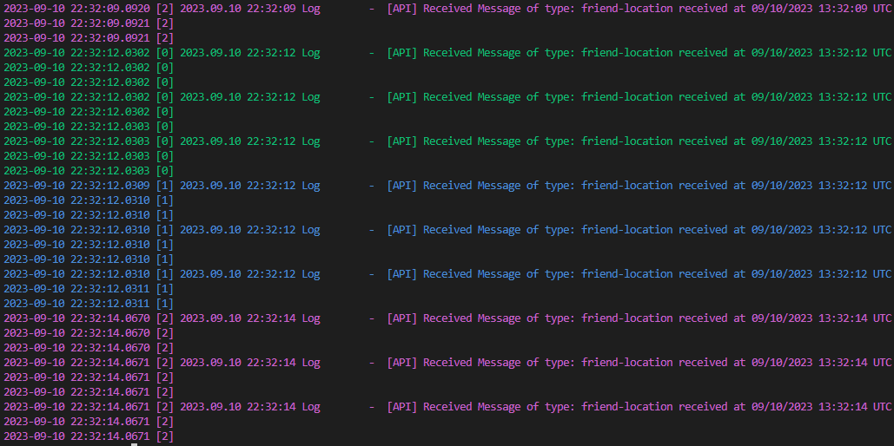

# vrc-tail

tail -f for VRChat logs

- reads recent set of logs (started in 30 seconds)
  - output_log_2023-09-10_12-12-00.txt: read as `[3]`
  - output_log_2023-09-10_12-11-40.txt: read as `[2]`
  - output_log_2023-09-10_12-11-10.txt: read as `[1]`
  - output_log_2023-09-10_12-10-50.txt: read as `[0]`
  - output_log_2023-09-10_12-10-00.txt: ignore
- colored



## Install

### Winget

```
winget install Narazaka.vrc-tail
```

### Portable

Download from [Release page](https://github.com/Narazaka/vrc-tail/releases/latest) and place somewhere.

## Console Commands

```
> Commands:
>   ? - show this help
>   q - quit
>   s - toggle ignore blank lines
>   l - toggle colored log level
>   d - toggle supress log date
>   /<str> - filter
>   r - reset filter
```

## License

[Zlib License](LICENSE)
