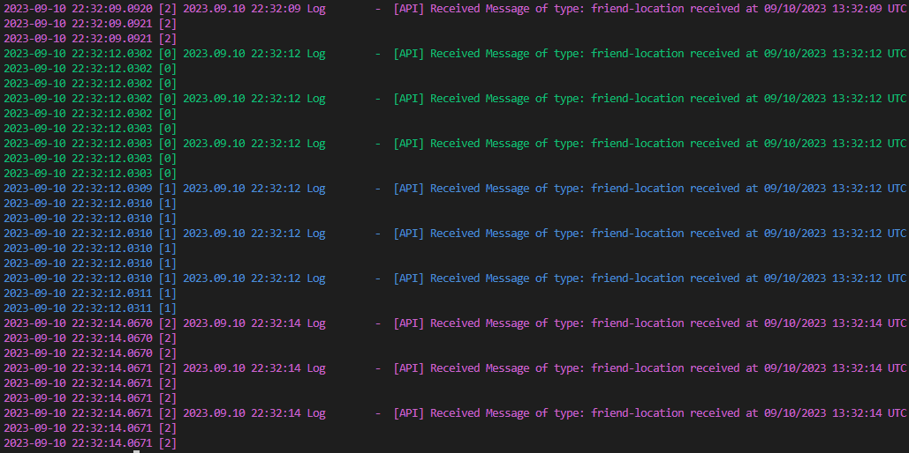

# vrc-tail

A native Windows `tail -f` for VRChat logs.

- Watches VRChat's log directory and prints lines appended after startup.
- Automatically follows newly created `output_log_*.txt` files.
- Reads logs whose start time is within 30 seconds of the newest log by default:
  - output_log_2023-09-10_12-12-00.txt: read as `[1]`
  - output_log_2023-09-10_12-11-40.txt: read as `[0]`
  - output_log_2023-09-10_12-11-10.txt: ignore
  - output_log_2023-09-10_12-10-50.txt: ignore
  - output_log_2023-09-10_12-10-00.txt: ignore
- Colors each log file and log level when writing to a terminal.
- Uses plain output when redirected or when [`NO_COLOR`](https://no-color.org/) is set.



## Install

### Winget

```powershell
winget install Narazaka.vrc-tail
```

### Portable

Download `vrc-tail.exe` from the [latest release](https://github.com/Narazaka/vrc-tail/releases/latest) and place it somewhere on `PATH`.

## Usage

Run `vrc-tail` without arguments to follow the current VRChat log group. Existing content is skipped; lines appended after startup are printed.

Use `--no-watch` to keep following only the files selected at startup. Use `--group-period` to change the time window used to select the current log group.

## Console Commands

When running in a terminal, press:

```
> Commands:
>   ? - show this help
>   q - quit
>   c - toggle case sensitive
>   s - toggle ignore blank lines
>   l - toggle colored log level
>   d - toggle suppress log date
>   /<str> - filter
>   r - reset filter
```

## Command-line Options

```
Usage: vrc-tail [OPTIONS]

Options:
  -f, --filter <FILTER>                   Show only matching lines
  -c, --case-sensitive                    Match filters case-sensitively
  -s, --ignore-blank-lines                Suppress blank lines
  -L, --no-colored-log-level              Disable per-level colors
  -d, --suppress-log-date                 Remove VRChat's date prefix
  -g, --group-period <GROUP_PERIOD_SECS>  Log group window [default: 30]
      --no-watch                          Do not add newly created log files
  -h, --help                              Print help
  -V, --version                           Print version
```

## Build from Source

Install the stable Rust MSVC toolchain on Windows, then run:

```powershell
rustup component add clippy rustfmt
cargo fmt --check
cargo clippy --locked --target x86_64-pc-windows-msvc -- -D warnings
cargo test --locked --target x86_64-pc-windows-msvc
cargo build --release --locked --target x86_64-pc-windows-msvc
```

The executable is written to `target/x86_64-pc-windows-msvc/release/vrc-tail.exe`.

## License

[Zlib License](LICENSE)
